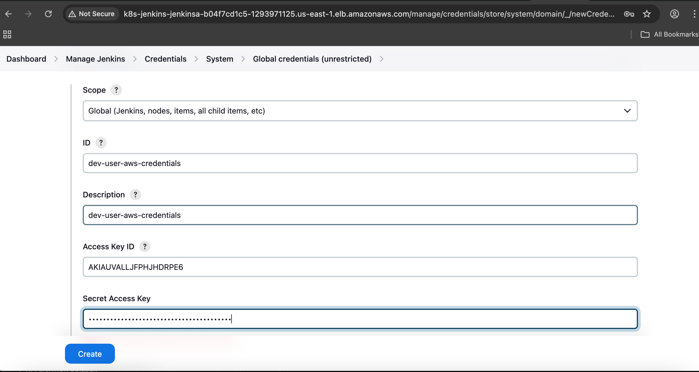
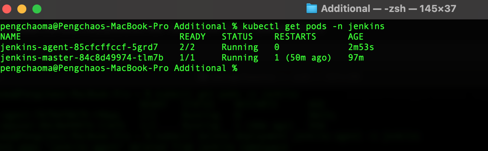
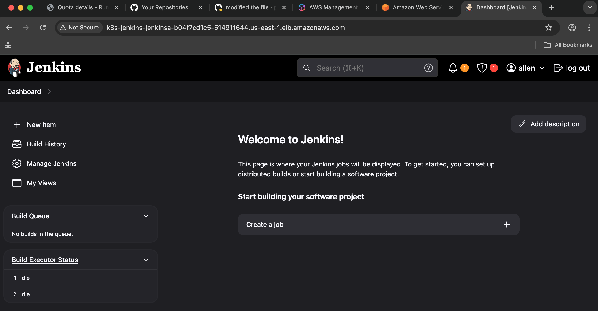
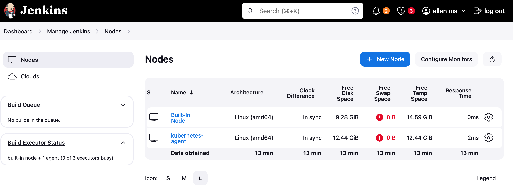

# Infrastructure-Jenkins-Deploy-To-EKS

In this demo, I will deploy jenkins to AWS EKS, one jenkins master and one jenkins agent. I also configured the aws cloud in jenkins setting so that the jenkins-agent pod can be auto dynamic create when needed 

## Features

- one jenkins-master and one jenkins-agent

- the jenkins-agent pod with sidecar model which is DinD(docker in docker) to run the docker 

   daemon

- the main jenkins-agent pod will have aws-cli and python3 installed and the DinD will have 

   docker installed 

- disabled csrf when you first login

- github actions for the cicd 

- alb ingress so that the jenkins can  be accessed through internet 

- PVC for both master and agent


## Usage

- you need to set the following variables in your github secrets

    - AWS_ACCESS_KEY_ID
    - AWS_SECRET_ACCESS_KEY
    - AWS_REGION
    - EKS_CLUSTER_NAME

- necessary jenkins plugins you may need to install

    - Kubernetes
    - Pipeline
    - Kubernetes CLI
    - Docker Pipeline
    - aws-credentials

- if you are first time to use jenkins please configure your aws credentials like this



- you can fork or clone this repo if you think you need it 
```shell
git clone https://github.com/pengchao2022/Infra-jenkins-aws-eks.git
```
- here's the pod running on EKS 




## Refrence

- here's the jenkins dashboard page



- with jenkins nodes secret created and the jenkins-agent is online now 



## Notice

- We just have one master pod and one agent pod running in EKS for the dev environment, in a production env you can modify the deployment replicas to have more pods and big memory.

Ma pengchao @2025

