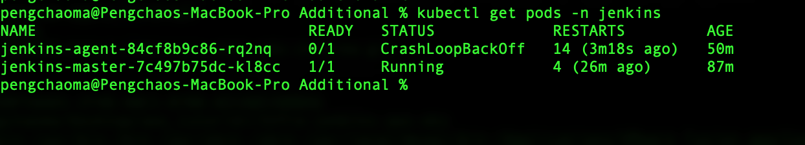

# Infrastructure-Jenkins-Deploy-To-EKS

In this demo, I will deploy jenkins to AWS EKS, one jenkins master and one jenkins agent. I also configured the aws cloud in jenkins setting so that the jenkins-agent pod can be auto dynamic create when needed 

## Features

- one jenkins-master and one jenkins-agent

- disabled csrf when you first login

- github actions for the cicd 

- alb ingress so that the jenkins can  be accessed through internet 

- PVC for both master and agent

## Usage

- you need to set the following variables in your github secrets

    - AWS_ACCESS_KEY_ID
    - AWS_SECRET_ACCESS_KEY
    - AWS_REGION
    - EKS_CLUSTER_NAME

- necessary jenkins plugins you may need to install

    - Kubernetes
    - Pipeline
    - Kubernetes CLI
    - Docker Pipeline

- you can fork or clone this repo if you think you need it 
```shell
git clone https://github.com/pengchao2022/Infra-jenkins-aws-eks.git
```
- here's the pod running on EKS 




## Refrence

- here's the jenkins dashboard page


## Notice

- For the jenkins-agent pod it's normal when it's not running , since when there is no job running , and the agent will stop without running . This is right not errors 

Ma pengchao @2025

